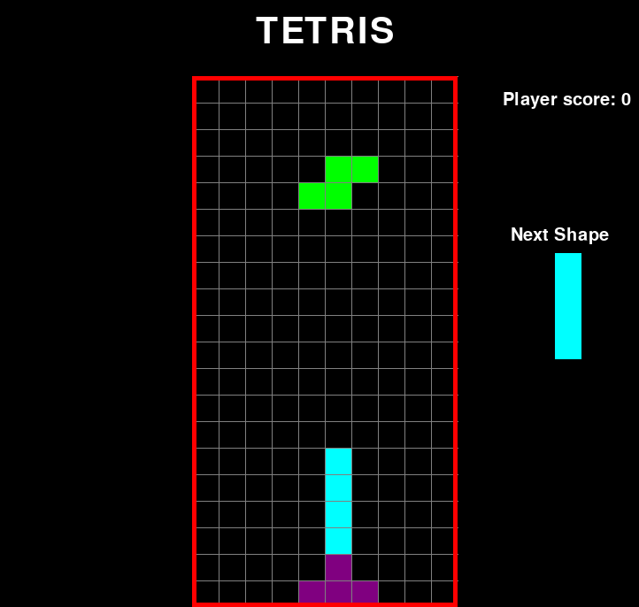

## Yet another tetris game
<!-- TABLE OF CONTENTS -->

  
Table of Contents

  <ol>
    <li>
      <a href="#about-the-project">About The Project</a>
        <li><a href="#installation">Installation</a></li>
      </ul>
    </li>
    <li><a href="#usage">Usage</a></li>
  </ol>

## About The Project

Simple script design specifically to kill time.

  

### Installation

make sure to run install first on requirements first.

## Usage

(<a href="#readme-top">back to top</a>)

